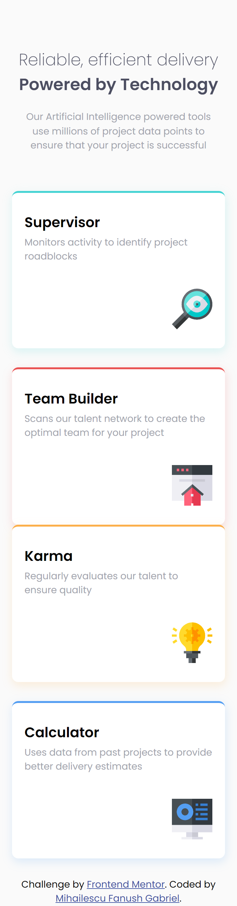
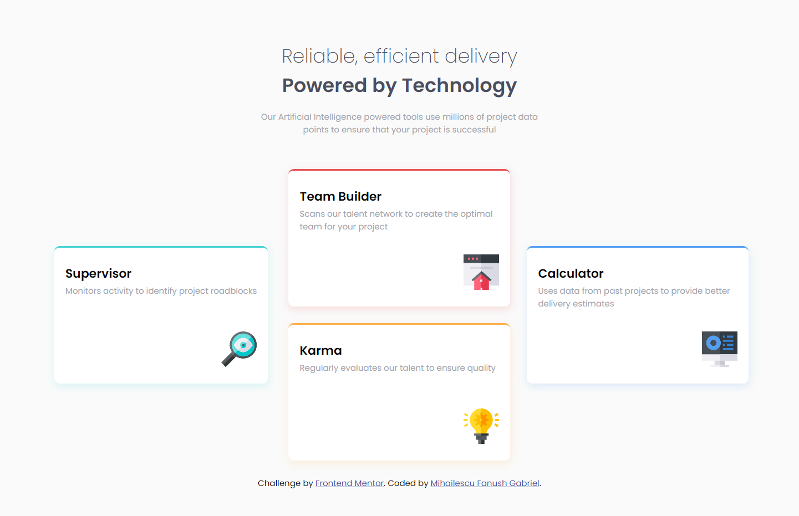

# Frontend Mentor - Four card feature section solution

This is a solution to the [Four card feature section challenge on Frontend Mentor](https://www.frontendmentor.io/challenges/four-card-feature-section-weK1eFYK). Frontend Mentor challenges help you improve your coding skills by building realistic projects. 

## Table of contents

- [Overview](#overview)
  - [The challenge](#the-challenge)
  - [Screenshot](#screenshot)
  - [Links](#links)
  - [Built with](#built-with)
  - [What I learned](#what-i-learned)
  - [Author](#author)

## Overview

### The challenge

Users should be able to:

- View the optimal layout for the site depending on their device's screen size

### Screenshot

### Links

- Solution URL: [Add solution URL here](https://github.com/Fanushhh/four-card-feature-section-master)
- Live Site URL: [Add live site URL here](https://fanushhh.github.io/four-card-feature-section-master/)

### Built with

- Semantic HTML5 markup
- CSS custom properties
- Flexbox
- CSS Grid
- Mobile-first workflow

### What I learned

I practiced a little bit more with the CSS Grid layout system and it is definitely interesting but it will take me some time to digest it properly being used to Flexbox, I feel like I don't need it but 
it is definitely good and both of them have their uses.

## Author

- Website - [Mihailescu Fanush](https://fanushhh.github.io/Stylized-Website/)
- Frontend Mentor - [@Fanushhh](https://www.frontendmentor.io/profile/Fanushhh)
